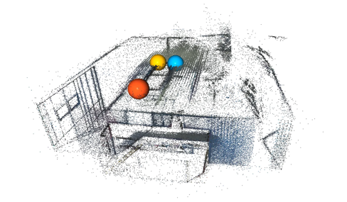
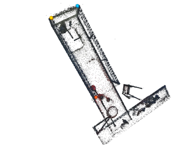
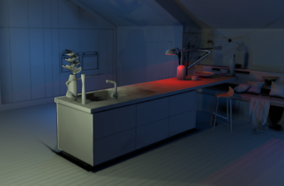

# GS-Reg: Interactive Registration for 3D Gaussian Splatting

An interactive registration framework that enables precise alignment and merging of multiple 3D Gaussian Splatting scenes through user-guided keypoint correspondence and ICP refinement.

## Overview

GS-Reg extends [3D Gaussian Splatting](https://github.com/graphdeco-inria/gaussian-splatting) with a semi-automatic registration pipeline that combines:
- **Interactive keypoint selection** for initial alignment
- **SVD-based transformation** estimation
- **Adaptive ICP refinement** for precise registration
- **Seamless scene merging** into a unified representation

## Installation

GS-Reg uses the same environment as the original 3D Gaussian Splatting:

```bash
conda env create --file environment.yml
conda activate gaussian_splatting
```

## Usage

```bash
python gs-registration.py <source_ply> <target_ply> <output_ply> [options]
```

### Required Arguments
- `source_ply`: Source 3DGS scene (PLY format)
- `target_ply`: Target 3DGS scene (PLY format)  
- `output_ply`: Merged output scene

### Key Options
- `--align_ground_plane`: Enable ground plane alignment
- `--icp_method`: Choose 'point_to_point' or 'point_to_plane' (default: point_to_point)
- `--max_iterations`: Maximum ICP iterations (default: 50)

## Interactive Keypoint Selection

The registration process begins with interactive correspondence selection:

1. **Source scene** opens in 3D viewer
2. **Shift+Click** to select keypoints (minimum 3)
3. Press **'Q'** when done
4. Repeat for **target scene**

### Example Keypoint Selection

#### Source Scene (House)


#### Target Scene (Kitchen)


The colored spheres indicate selected keypoints that establish correspondence between scenes.

## Results

GS-Reg achieves accurate alignment through the combination of manual correspondence and automatic refinement:

#### Merged Result


#### Ground Truth Reference


## Example Command

```bash
# Basic registration
python gs-registration.py scene1.ply scene2.ply merged.ply

# With ground plane alignment
python gs-registration.py scene1.ply scene2.ply merged.ply --align_ground_plane
```

## Citation

If you find this work useful, please consider citing:
```bibtex
@misc{gsreg2024,
  title={GS-Reg: Interactive Registration for 3D Gaussian Splatting},
  author={Your Name},
  year={2024},
  url={https://github.com/yourusername/gs-reg}
}
```
